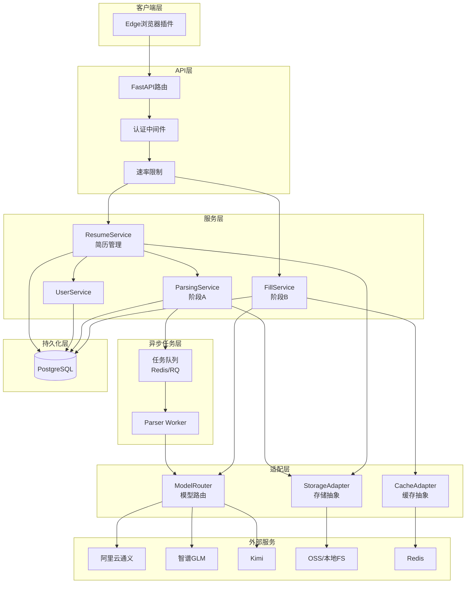
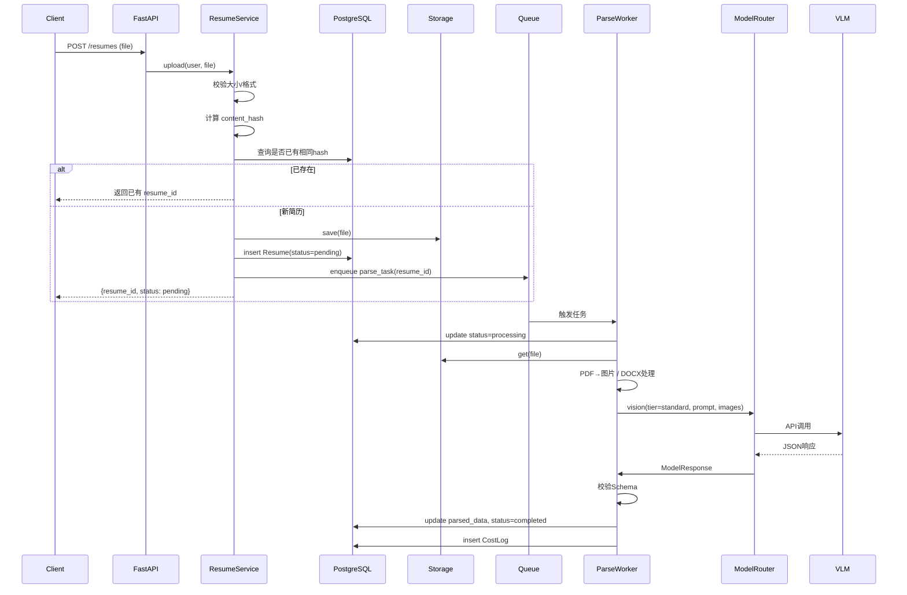
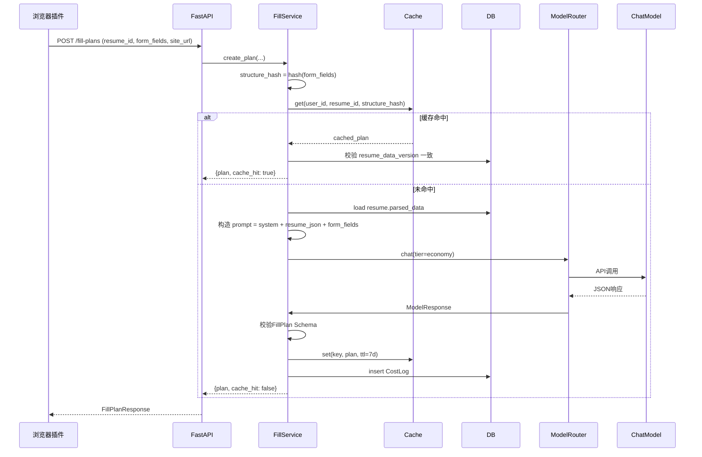
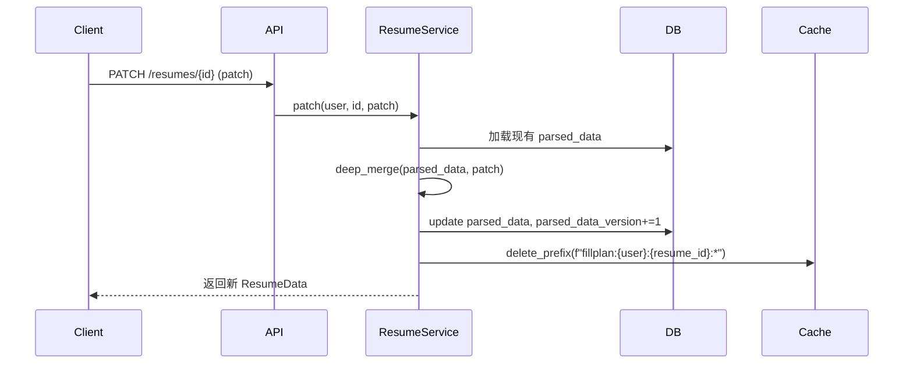

# Design Document

## Overview

简历解析平台采用分层架构 + 抽象适配器模式，确保模型、存储、缓存等基础设施可插拔。整体基于 Python + FastAPI 构建，遵循"配置外置、存储抽象、模型抽象"三大可移植性原则，使本地 MacBook Pro M4 上跑通的代码能无痛迁移到云端。

核心设计思想：

- **双阶段解耦**：阶段 A（解析）与阶段 B（填写）相互独立，A 的输出是 B 的输入，B 不感知 A 的实现
- **抽象适配器**：模型、存储、缓存等外部依赖均通过 Protocol/ABC 接口暴露，运行时通过工厂注入具体实现
- **异步优先**：阶段 A 解析耗时较长（3-15 秒），通过任务队列异步执行；阶段 B 实时同步返回
- **AI推理优先**：拒绝预定义"标签库"，所有字段语义匹配交给 LLM 实时推理
- **成本可控**：模型路由、token 计费、缓存复用三层优化

## Architecture

### High-Level Architecture



### Layered Architecture

```
┌──────────────────────────────────────────────────────┐
│  Presentation Layer (FastAPI Routes)                 │  HTTP路由、参数校验、认证
├──────────────────────────────────────────────────────┤
│  Service Layer (Business Logic)                      │  业务编排、事务边界
├──────────────────────────────────────────────────────┤
│  Adapter Layer (Model / Storage / Cache)             │  外部依赖抽象
├──────────────────────────────────────────────────────┤
│  Repository Layer (Data Access)                      │  数据库访问
├──────────────────────────────────────────────────────┤
│  Infrastructure (DB / Queue / External APIs)         │  基础设施
└──────────────────────────────────────────────────────┘
```

### Project Structure

```
cv_rec/
├── app/
│   ├── api/                          # FastAPI 路由层
│   │   ├── __init__.py
│   │   ├── v1/
│   │   │   ├── resumes.py           # 简历 CRUD + 解析触发
│   │   │   ├── fill_plans.py        # 阶段B 填写方案
│   │   │   ├── users.py             # 用户管理
│   │   │   └── health.py            # 探活
│   │   ├── deps.py                  # 依赖注入（current_user、db_session）
│   │   └── errors.py                # 统一错误处理
│   │
│   ├── services/                     # 业务逻辑层
│   │   ├── resume_service.py        # 简历管理（上传、查询、修正、删除）
│   │   ├── parsing_service.py       # 阶段A 编排
│   │   ├── fill_service.py          # 阶段B 编排
│   │   ├── user_service.py
│   │   └── cost_service.py          # 成本统计与限额
│   │
│   ├── adapters/                     # 适配层（核心扩展点）
│   │   ├── models/
│   │   │   ├── base.py              # ChatModel / VisionModel 协议
│   │   │   ├── qwen.py              # 通义千问 VL
│   │   │   ├── glm.py               # 智谱 GLM
│   │   │   ├── kimi.py              # Moonshot Kimi
│   │   │   └── router.py            # 模型路由策略
│   │   ├── storage/
│   │   │   ├── base.py              # StorageBackend 协议
│   │   │   ├── local.py             # 本地文件系统
│   │   │   └── oss.py               # 阿里云OSS / S3
│   │   └── cache/
│   │       ├── base.py
│   │       ├── memory.py            # 内存缓存（开发期）
│   │       └── redis.py             # Redis（生产）
│   │
│   ├── parsers/                      # 文档预处理
│   │   ├── pdf_parser.py            # PDF→图片
│   │   ├── docx_parser.py           # DOCX→文本+图片
│   │   └── image_parser.py          # 图片预处理
│   │
│   ├── prompts/                      # Prompt 模板
│   │   ├── parse_resume.py          # 阶段A prompt
│   │   └── fill_form.py             # 阶段B prompt
│   │
│   ├── schemas/                      # Pydantic 模型
│   │   ├── resume.py                # 结构化简历 Schema (核心契约)
│   │   ├── fill_plan.py             # 填写方案 Schema
│   │   ├── api.py                   # API 请求/响应模型
│   │   └── enums.py                 # 枚举（学历、性别等）
│   │
│   ├── repositories/                 # 数据访问层
│   │   ├── base.py                  # BaseRepository
│   │   ├── user_repo.py
│   │   ├── resume_repo.py
│   │   ├── fill_plan_cache_repo.py
│   │   └── cost_log_repo.py
│   │
│   ├── models/                       # SQLAlchemy ORM
│   │   ├── base.py
│   │   ├── user.py
│   │   ├── resume.py
│   │   └── cost_log.py
│   │
│   ├── workers/                      # 异步任务
│   │   ├── parse_worker.py
│   │   └── queue.py                 # 任务队列封装
│   │
│   ├── core/                         # 核心基础设施
│   │   ├── config.py                # 配置管理（pydantic-settings）
│   │   ├── security.py              # 加密、Token、密码
│   │   ├── logging.py               # 结构化日志
│   │   ├── exceptions.py            # 自定义异常
│   │   └── db.py                    # 数据库连接
│   │
│   └── main.py                       # FastAPI 启动入口
│
├── tests/
│   ├── unit/
│   ├── integration/
│   ├── property/                    # PBT 测试
│   └── fixtures/                    # 测试用简历样本
│
├── docker-compose.yml               # 本地开发栈
├── Dockerfile
├── .env.example
├── pyproject.toml
└── ARCHITECTURE.md                  # 框架说明文档
```

## Components and Interfaces

### 1. API Layer

#### 1.1 Resume Routes (`app/api/v1/resumes.py`)

```python
@router.post("/resumes", response_model=ResumeUploadResponse)
async def upload_resume(
    file: UploadFile,
    current_user: User = Depends(get_current_user),
    resume_service: ResumeService = Depends(),
) -> ResumeUploadResponse:
    """上传简历，返回任务ID。解析异步执行。"""

@router.get("/resumes/{resume_id}/status")
async def get_parse_status(resume_id: UUID) -> ParseStatusResponse: ...

@router.get("/resumes/{resume_id}", response_model=ResumeData)
async def get_resume(resume_id: UUID) -> ResumeData:
    """获取结构化简历数据。schema_version 字段标识版本。"""

@router.patch("/resumes/{resume_id}", response_model=ResumeData)
async def update_resume(
    resume_id: UUID,
    patch: ResumePatch,
) -> ResumeData:
    """用户手动修正解析结果"""

@router.delete("/resumes/{resume_id}")
async def delete_resume(resume_id: UUID) -> None: ...

@router.get("/resumes")
async def list_resumes(current_user: User = Depends(get_current_user)) -> list[ResumeMeta]: ...
```

#### 1.2 Fill Plan Routes (`app/api/v1/fill_plans.py`)

```python
@router.post("/fill-plans", response_model=FillPlanResponse)
async def create_fill_plan(
    request: FillPlanRequest,
    current_user: User = Depends(get_current_user),
    fill_service: FillService = Depends(),
) -> FillPlanResponse:
    """阶段B：根据表单字段返回智能填写方案"""
```

#### 1.3 错误响应统一格式

```json
{
  "code": "RESUME_NOT_FOUND",
  "message": "Resume not found or access denied",
  "details": {"resume_id": "..."},
  "request_id": "uuid"
}
```

### 2. Service Layer

#### 2.1 ResumeService

```python
class ResumeService:
    def __init__(
        self,
        resume_repo: ResumeRepository,
        storage: StorageBackend,
        queue: TaskQueue,
    ): ...

    async def upload(self, user_id: UUID, file: UploadFile) -> Resume:
        """1. 校验文件; 2. 计算内容哈希去重; 3. 持久化原始文件; 4. 创建Resume记录; 5. 投递解析任务"""

    async def get(self, user_id: UUID, resume_id: UUID) -> Resume:
        """带权限校验"""

    async def patch(self, user_id: UUID, resume_id: UUID, patch: dict) -> Resume:
        """部分更新结构化数据，version+1"""

    async def delete(self, user_id: UUID, resume_id: UUID) -> None:
        """级联删除：原始文件、解析结果、相关缓存"""
```

#### 2.2 ParsingService（阶段A）

```python
class ParsingService:
    def __init__(self, model_router: ModelRouter, storage: StorageBackend): ...

    async def parse(self, resume: Resume) -> ResumeData:
        """
        1. 从存储读取原始文件
        2. 根据格式预处理：PDF/DOCX→图片，图片直接用
        3. 调用 ModelRouter 选择视觉模型
        4. 构造 prompt + image_url，发送请求
        5. 解析响应JSON，验证Schema
        6. 失败重试1次
        7. 返回 ResumeData
        """

    async def _validate_schema(self, raw: str) -> ResumeData:
        """JSON结构验证 + Pydantic校验"""
```

#### 2.3 FillService（阶段B）

```python
class FillService:
    def __init__(
        self,
        model_router: ModelRouter,
        cache: CacheBackend,
        resume_repo: ResumeRepository,
    ): ...

    async def create_plan(
        self,
        user_id: UUID,
        resume_id: UUID,
        form_fields: list[FormField],
        site_url: str,
    ) -> FillPlan:
        """
        1. 计算 cache_key = hash(resume_version, form_structure)
        2. 命中缓存 → 直接返回
        3. 未命中 → 加载简历JSON + 构造prompt
        4. 调用 ModelRouter（默认聊天模型）
        5. 校验输出 Schema
        6. 存入缓存（TTL 7天）
        7. 返回 FillPlan
        """

    def _form_structure_hash(self, fields: list[FormField]) -> str:
        """对字段id+label+type+options做规范化哈希"""
```

### 3. Adapter Layer

#### 3.1 Model Adapter（核心扩展点）

```python
# app/adapters/models/base.py

class ModelCapability(str, Enum):
    VISION = "vision"
    CHAT = "chat"

class ModelTier(str, Enum):
    ECONOMY = "economy"      # 经济：qwen-vl-plus / GLM-FlashX
    STANDARD = "standard"    # 标准：qwen-vl-max / GLM-4.6V
    FLAGSHIP = "flagship"    # 旗舰：GLM-4.5V

class ModelResponse(BaseModel):
    content: str
    input_tokens: int
    output_tokens: int
    cost_cny: Decimal
    model_id: str
    latency_ms: int

class ChatModel(Protocol):
    """文本对话模型协议（阶段B）"""
    async def chat(
        self,
        system: str,
        user: str,
        response_format: Literal["text", "json"] = "json",
    ) -> ModelResponse: ...

class VisionModel(Protocol):
    """视觉模型协议（阶段A）"""
    async def vision_chat(
        self,
        system: str,
        user: str,
        images: list[bytes | str],
        response_format: Literal["text", "json"] = "json",
    ) -> ModelResponse: ...
```

#### 3.2 ModelRouter（模型路由）

```python
class ModelRouter:
    """
    根据 capability + tier 选择具体模型，支持失败降级
    路由策略示例：
    - 阶段A 默认：qwen-vl-plus（standard tier）
    - 阶段B 默认：GLM-4.6V-FlashX（economy tier）
    - 用户主动选择tier时按其偏好
    - 默认模型失败 → 备用模型
    """
    def __init__(self, registry: dict[str, ChatModel | VisionModel], policy: RoutingPolicy): ...

    async def chat(self, tier: ModelTier, **kwargs) -> ModelResponse: ...

    async def vision(self, tier: ModelTier, **kwargs) -> ModelResponse: ...

    async def _with_fallback(self, primary: str, fallback: str, call): ...
```

#### 3.3 Storage Adapter

```python
class StorageBackend(Protocol):
    async def save(self, key: str, data: bytes, content_type: str) -> str:
        """返回可访问的URL或key"""

    async def get(self, key: str) -> bytes: ...

    async def delete(self, key: str) -> None: ...

    async def exists(self, key: str) -> bool: ...

# 实现：LocalFSStorage / OSSStorage / S3Storage
# 通过 settings.storage_backend 工厂选择
```

#### 3.4 Cache Adapter

```python
class CacheBackend(Protocol):
    async def get(self, key: str) -> bytes | None: ...
    async def set(self, key: str, value: bytes, ttl_seconds: int) -> None: ...
    async def delete(self, key: str) -> None: ...
    async def delete_prefix(self, prefix: str) -> int: ...  # 用户改简历后清除其所有缓存
```

### 4. Worker Layer

```python
# app/workers/parse_worker.py
async def parse_worker(resume_id: UUID):
    """
    异步解析任务入口（RQ/Celery worker）
    1. 从DB加载Resume
    2. 调用 ParsingService.parse()
    3. 更新DB状态：parsed/failed
    4. 失败时记录详细错误，不重新入队（由用户主动重试）
    """
```

## Data Models

### 4.1 Database Schema (PostgreSQL via SQLAlchemy)

```python
class User(Base):
    id: UUID = primary_key
    username: str = unique_indexed
    email: str | None
    api_key_hash: str
    created_at: datetime
    plan_tier: str  # free/standard/pro

class Resume(Base):
    id: UUID = primary_key
    user_id: UUID = foreign_key(User)
    is_default: bool = default(False)

    # 原始文件
    original_filename: str
    file_format: str  # pdf/docx/png/jpg
    file_size: int
    file_storage_key: str           # 在StorageBackend中的key
    content_hash: str = indexed     # 内容SHA256，用于去重

    # 解析状态
    parse_status: str  # pending/processing/completed/failed
    parse_started_at: datetime | None
    parse_completed_at: datetime | None
    parse_error: str | None
    parse_model: str | None
    parse_input_tokens: int | None
    parse_output_tokens: int | None
    parse_cost_cny: Decimal | None

    # 解析结果
    schema_version: str = "1.0"
    parsed_data: JSONB | None       # 结构化简历JSON
    parsed_data_version: int = 1    # 用户每次修正+1

    created_at: datetime
    updated_at: datetime

class FillPlanCache(Base):
    id: UUID = primary_key
    user_id: UUID = foreign_key(User)
    resume_id: UUID = foreign_key(Resume)
    resume_data_version: int        # 命中校验
    site_domain: str = indexed
    form_structure_hash: str = indexed
    plan_data: JSONB                # 缓存的填写方案
    expires_at: datetime
    hit_count: int = default(0)
    created_at: datetime

class CostLog(Base):
    id: UUID = primary_key
    user_id: UUID
    stage: str  # parsing/filling
    model_id: str
    input_tokens: int
    output_tokens: int
    cost_cny: Decimal
    success: bool
    latency_ms: int
    created_at: datetime = indexed
```

### 4.2 ResumeData Schema（核心契约）

```python
# app/schemas/resume.py

SCHEMA_VERSION = "1.0"

class BasicInfo(BaseModel):
    name: str | None
    gender: Literal["男", "女", "其他"] | None
    birth_date: str | None       # YYYY-MM-DD
    age: int | None
    phone: str | None
    email: str | None
    location: str | None         # 现居
    hometown: str | None         # 籍贯
    marital_status: Literal["未婚", "已婚", "离异", "其他"] | None
    political_status: str | None
    ethnicity: str | None
    id_card: str | None          # 仅在用户明确填写时

class JobIntent(BaseModel):
    target_position: str | None
    expected_salary: str | None
    available_date: str | None
    work_location_preference: list[str] = []

class Education(BaseModel):
    school: str
    degree: Literal["大专", "本科", "硕士", "博士", "其他"] | None
    major: str | None
    start_date: str | None       # YYYY-MM
    end_date: str | None         # YYYY-MM 或 "至今"
    gpa: str | None              # 字符串保留原值
    honors: list[str] = []
    courses: list[str] = []

class WorkExperience(BaseModel):
    company: str
    title: str | None
    start_date: str | None
    end_date: str | None
    achievements: list[str] = []
    tech_stack: list[str] = []

class ProjectExperience(BaseModel):
    name: str
    role: str | None
    start_date: str | None
    end_date: str | None
    tech_stack: list[str] = []
    description: str | None
    achievements: list[str] = []

class Skills(BaseModel):
    programming_languages: list[str] = []
    frameworks: list[str] = []
    databases: list[str] = []
    middleware: list[str] = []
    cloud_native: list[str] = []
    soft_skills: list[str] = []

class Certification(BaseModel):
    name: str
    issuer: str | None
    date: str | None

class Language(BaseModel):
    language: str
    level: str | None
    score: str | None

class ResumeData(BaseModel):
    schema_version: str = SCHEMA_VERSION
    basic_info: BasicInfo
    job_intent: JobIntent | None
    education: list[Education] = []
    work_experience: list[WorkExperience] = []
    project_experience: list[ProjectExperience] = []
    skills: Skills
    certifications: list[Certification] = []
    languages: list[Language] = []
    self_evaluation: str | None
```

### 4.3 FillPlan Schema

```python
class FormField(BaseModel):
    id: str
    label: str
    type: Literal["text", "tel", "email", "number", "date", "select",
                  "radio", "checkbox", "textarea", "repeater"]
    options: list[str] | None = None   # select/radio
    required: bool = False
    sub_fields: list["FormField"] | None = None  # repeater 子字段
    max_length: int | None = None

class FillPlanRequest(BaseModel):
    resume_id: UUID                     # 不传则用 default
    site_url: str                       # 用于域名识别 + 缓存
    form_fields: list[FormField]
    user_overrides: dict[str, str] = {} # 用户预先指定的字段值

class FilledField(BaseModel):
    field_id: str
    value: str | list[dict]             # repeater 时为列表
    confidence: float                   # 0-1
    reasoning: str
    source: str                         # 简历中哪个字段衍生

class FillPlanResponse(BaseModel):
    plan_id: UUID
    filled: dict[str, FilledField]      # field_id → 填写结果
    needs_user_input: list[str]         # 无法自动填写的字段
    warnings: list[str]
    cache_hit: bool
    model_used: str | None
    cost_cny: Decimal | None
```

## Key Workflows

### 5.1 简历上传与解析（阶段A）



### 5.2 智能填写（阶段B）



### 5.3 用户修正解析结果



## Error Handling

### 6.1 错误分类

| 类别 | HTTP | code 前缀 | 示例 |
|------|------|-----------|------|
| 参数错误 | 400 | `VALIDATION_*` | `VALIDATION_FILE_TOO_LARGE` |
| 认证失败 | 401 | `AUTH_*` | `AUTH_TOKEN_INVALID` |
| 权限不足 | 403 | `FORBIDDEN_*` | `FORBIDDEN_RESUME_ACCESS` |
| 资源不存在 | 404 | `NOT_FOUND_*` | `NOT_FOUND_RESUME` |
| 速率限制 | 429 | `RATE_LIMIT_*` | `RATE_LIMIT_EXCEEDED` |
| 业务错误 | 422 | `BUSINESS_*` | `BUSINESS_PARSE_FAILED` |
| 模型错误 | 502 | `MODEL_*` | `MODEL_UNAVAILABLE` |
| 服务降级 | 503 | `BUDGET_EXCEEDED` | 当日成本超限 |
| 内部错误 | 500 | `INTERNAL_*` | 不暴露细节 |

### 6.2 模型调用失败处理

```python
async def call_with_retry(self, primary, fallback, **kwargs):
    try:
        return await primary.invoke(**kwargs)
    except (Timeout, RateLimitError) as e:
        log.warning("primary_failed", model=primary.id, error=str(e))
        try:
            return await primary.invoke(**kwargs)  # 重试1次
        except Exception:
            log.warning("primary_retry_failed, fallback")
            return await fallback.invoke(**kwargs)
    except SchemaValidationError as e:
        # JSON格式错误，加更严格的格式约束重试
        kwargs["system"] += "\n严格只输出JSON，不要Markdown。"
        return await primary.invoke(**kwargs)
```

### 6.3 解析失败的兜底

- 一次重试仍失败 → 标记 status=failed，记录错误
- 用户可在前端看到"解析失败"提示，主动点击重试
- 极端情况（多次失败）→ 切换到旗舰模型重新尝试一次（由用户触发）

## Security & Privacy

### 7.1 认证

- MVP：API Key（每用户生成 SHA256 哈希存储，明文仅返回一次）
- 后期：OAuth2 / 微信登录（不在本Spec范围）

### 7.2 数据保护

| 数据 | 处理方式 |
|------|---------|
| 简历原始文件 | 存储路径按 `{user_id}/{resume_id}/...` 隔离 |
| 身份证号、银行卡号 | DB 字段层面 AES 加密 |
| 手机号、邮箱 | 日志中脱敏（138****0000） |
| API Key | 仅存哈希 |
| 模型API Key | 通过环境变量注入，不入库 |
| 简历内容 | 不写入应用日志（仅记录 resume_id） |

### 7.3 速率限制

- 上传：每用户 10/小时
- 阶段B 填写：每用户 60/小时
- 全局：单 IP 100 请求/分钟

## Configuration

```python
# app/core/config.py

class Settings(BaseSettings):
    # 应用
    app_env: Literal["dev", "prod"] = "dev"
    log_level: str = "INFO"

    # 数据库
    database_url: str

    # 队列
    redis_url: str

    # 存储
    storage_backend: Literal["local", "oss", "s3"] = "local"
    storage_local_path: str = "./data/uploads"
    oss_endpoint: str | None = None
    oss_bucket: str | None = None
    oss_access_key: str | None = None
    oss_secret_key: str | None = None

    # 缓存
    cache_backend: Literal["memory", "redis"] = "memory"

    # 模型
    qwen_api_key: str | None = None
    glm_api_key: str | None = None
    moonshot_api_key: str | None = None

    # 路由策略
    parsing_default_model: str = "qwen-vl-plus"
    parsing_fallback_model: str = "glm-4.6v"
    filling_default_model: str = "glm-4.6v-flashx"
    filling_fallback_model: str = "qwen-vl-plus"

    # 成本控制
    daily_cost_limit_cny: Decimal = Decimal("100")
    user_daily_call_limit: int = 200

    # 安全
    secret_key: str
    encryption_key: str  # 用于敏感字段加密

    # 文件
    max_file_size_mb: int = 10
    allowed_formats: list[str] = ["pdf", "docx", "png", "jpg", "jpeg"]

    class Config:
        env_file = ".env"
```

## Correctness Properties

为保证关键行为的正确性，使用 Hypothesis 编写以下基于属性的测试。

### Property 1: ResumeData 反序列化幂等性

> 任何合法的 ResumeData 序列化为 JSON 后再反序列化，应得到相同的对象。

```python
@given(resume_data_strategy())
def prop_serialization_roundtrip(rd: ResumeData):
    assert ResumeData.parse_raw(rd.json()) == rd
```

### Property 2: 用户隔离

> 不存在 user_a 通过任何 API 路径访问到 user_b 的简历或填写方案。

```python
@given(two_users(), resume_strategy())
def prop_user_isolation(users, resume):
    user_a, user_b = users
    save_resume(user_a, resume)
    with pytest.raises(ForbiddenError):
        ResumeService.get(user_b, resume.id)
```

### Property 3: 删除级联

> 用户删除简历后，相关的原始文件、解析结果、填写方案缓存均应被清除。

```python
@given(resume_with_cache_strategy())
def prop_delete_cascades(resume, cache_keys):
    ResumeService.delete(resume.user_id, resume.id)
    assert not Storage.exists(resume.file_storage_key)
    assert ResumeRepo.get(resume.id) is None
    for key in cache_keys:
        assert Cache.get(key) is None
```

### Property 4: 填写方案不编造数据

> FillPlan 中所有 confidence > 0.5 的字段值，必须能在源简历或推断链中找到根据。

```python
@given(resume_data_strategy(), form_fields_strategy())
def prop_no_hallucination(resume, form_fields):
    plan = FillService.create_plan(resume, form_fields)
    for fid, field in plan.filled.items():
        if field.confidence > 0.5:
            assert is_traceable(field.value, field.source, resume)
```

### Property 5: 缓存一致性

> 同一 (user_id, resume_id, form_structure) 在 resume_data_version 不变期间，应稳定返回相同的 plan。

```python
@given(resume, form_fields)
def prop_cache_consistency(resume, form_fields):
    plan1 = FillService.create_plan(resume, form_fields)
    plan2 = FillService.create_plan(resume, form_fields)
    assert plan1.filled == plan2.filled
```

### Property 6: 成本计算单调性

> 累计 token 数和成本只增不减，CostLog 总和等于实际消耗。

```python
@given(call_sequence_strategy())
def prop_cost_monotonic(calls):
    initial = total_cost()
    for c in calls:
        execute(c)
    final = total_cost()
    assert final >= initial
    assert final - initial == sum(c.expected_cost for c in calls)
```

### Property 7: Schema 版本兼容

> 新版本 ResumeData 解析旧版本数据应不抛异常（向前兼容）。

```python
@given(resume_data_v1_strategy())
def prop_schema_backward_compat(rd_v1: dict):
    parsed = ResumeData.parse_obj(rd_v1)
    assert parsed.schema_version  # 不报错
```

## Testing Strategy

### 8.1 测试金字塔

```
        ┌────────────┐
        │  E2E (5%)  │  完整流程：上传→解析→填写
        ├────────────┤
        │ Integration│  服务+DB+模型 mock
        │   (25%)    │
        ├────────────┤
        │ Property   │  关键不变量
        │   (10%)    │
        ├────────────┤
        │   Unit     │  纯函数、Schema、Adapter
        │   (60%)    │
        └────────────┘
```

### 8.2 模型调用 Mock

- 单元测试：使用 `FakeModel` 返回预设响应
- 集成测试：可选切换到真实模型（环境变量控制），跑少量 smoke test
- 测试 fixtures：包含 5-10 份典型中文简历样本（PDF/DOCX/图片）

### 8.3 关键场景

| 场景 | 类型 | 关注点 |
|------|------|--------|
| 上传 PDF → 异步解析 → 查询结果 | E2E | 完整链路 |
| 上传相同文件 → 复用解析 | Integration | 内容哈希去重 |
| 解析失败 → 重试 → 仍失败 | Integration | 错误处理 |
| 填写方案缓存命中 vs 未命中 | Integration | 缓存路径 |
| 用户A 访问 用户B 简历 | Integration | 权限隔离 |
| 模型主备切换 | Integration | Router 容错 |
| 成本超限自动降级 | Integration | 限额逻辑 |
| 简历JSON序列化往返 | Property | Schema 稳健 |
| FillPlan 不编造数据 | Property | LLM 输出校验 |

## Local Development & Cloud Migration

### 9.1 本地开发栈

```yaml
# docker-compose.yml
services:
  postgres:
    image: postgres:16
    environment:
      POSTGRES_DB: cv_rec
      POSTGRES_USER: dev
      POSTGRES_PASSWORD: dev
    ports: ["5432:5432"]

  redis:
    image: redis:7-alpine
    ports: ["6379:6379"]

  app:
    build: .
    env_file: .env
    depends_on: [postgres, redis]
    ports: ["8000:8000"]
    volumes:
      - ./data/uploads:/app/data/uploads
```

### 9.2 上云路径

| 本地组件 | 云端替换 | 配置切换点 |
|---------|---------|-----------|
| Local FS | 阿里云 OSS / S3 | `STORAGE_BACKEND=oss` |
| 本地 Postgres | RDS PostgreSQL | `DATABASE_URL` |
| 本地 Redis | ElastiCache / 云 Redis | `REDIS_URL` |
| FastAPI 单机 | Docker → ECS / K8s | Dockerfile 复用 |
| 本地 RQ Worker | 同镜像独立部署 | 同 Docker |

### 9.3 环境隔离

- `.env.development` / `.env.production` 分别配置
- `app_env` 决定日志级别、CORS、调试模式
- 敏感配置走云厂商的 KMS / Secrets Manager

## Open Questions

下列问题需要在实施前与团队/插件端同事对齐：

1. **认证方式**：MVP 用 API Key 还是直接做手机号登录？影响用户表和路由层。
2. **多简历策略**：MVP 支持每用户多份还是仅 1 份？影响 ResumeService 和插件端 UX。
3. **填写方案是否实时**：阶段B 平均需 1-3 秒，是否需要 streaming 输出？影响 API 形态。
4. **简历文件保留期**：是否需要"解析后自动删除原始文件"模式以增强隐私？
5. **多租户隔离**：是否需要预留团队/企业版的多租户能力？影响数据模型。
