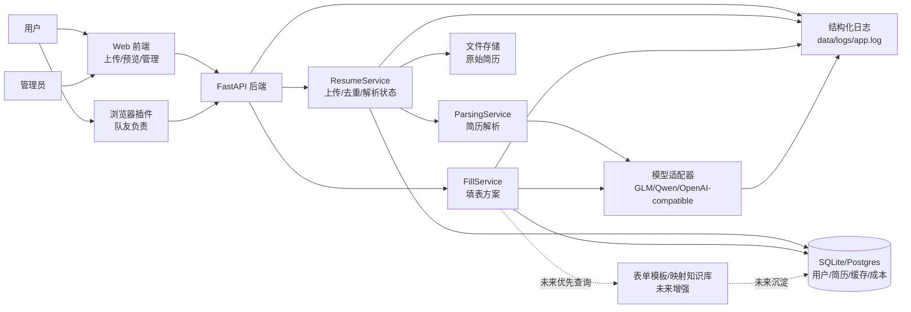
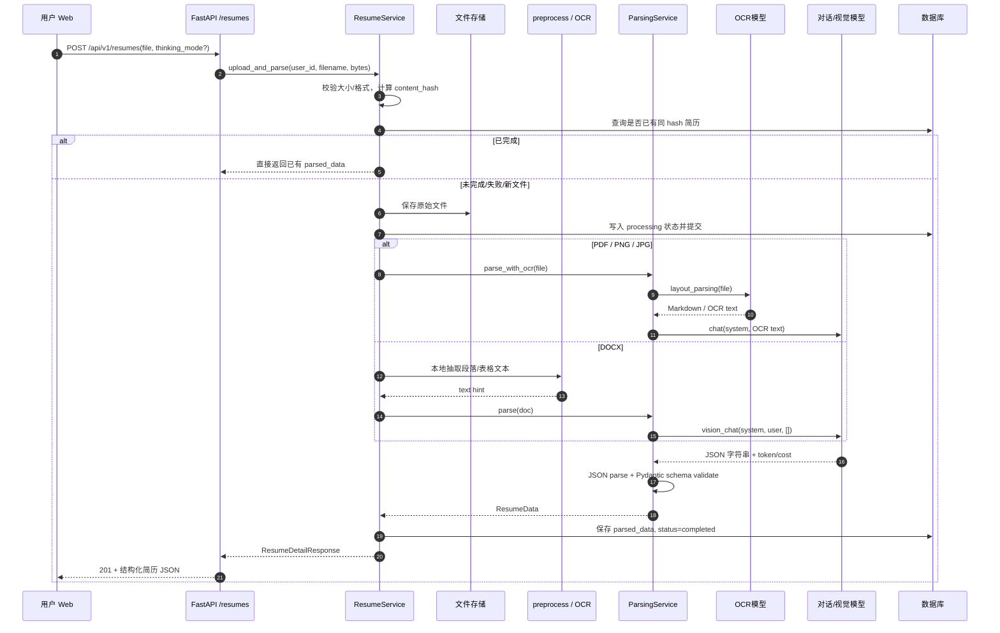
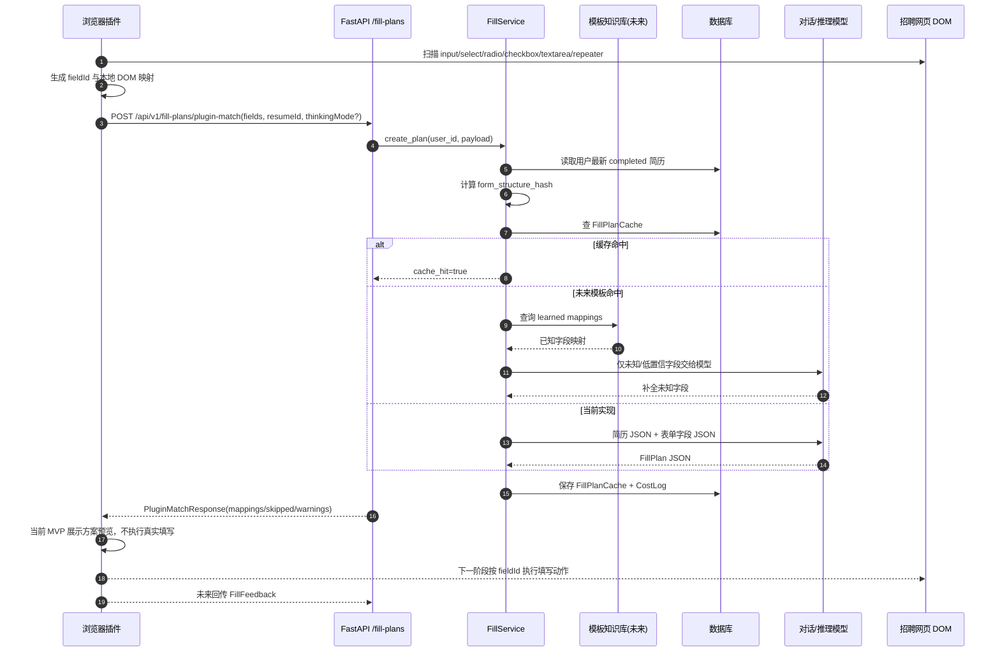
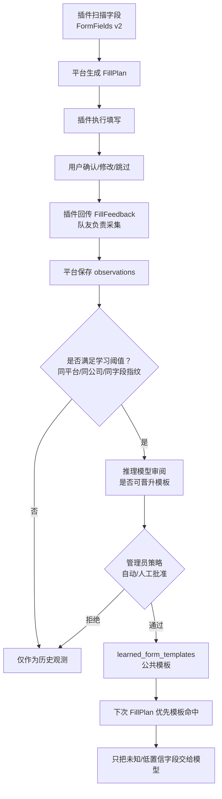
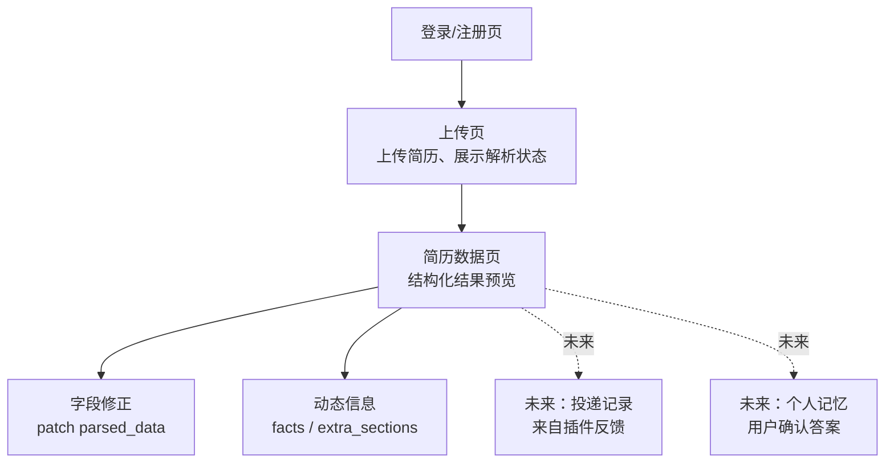
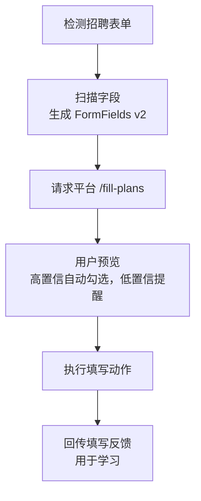
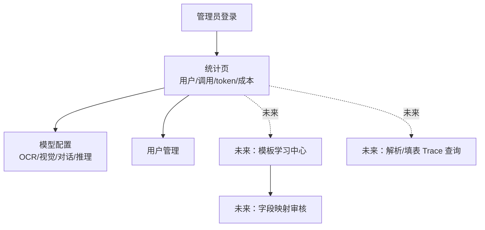

# 产品数据流与 PRD 原型说明

> 面向产品负责人、后端开发者、插件开发同学。  
> 目标：把“简历一次解析，长期复用；插件识别企业招聘表单；平台语义匹配并返回填写方案；系统越用越强”的功能关系、数据流、数据格式讲清楚。

---

## 1. 当前产品目标

用户上传一份简历后，平台将其解析为结构化 JSON，并长期保存。后续用户在不同企业招聘系统投递时，浏览器插件负责扫描网页表单字段，将字段列表传给平台。平台读取用户已解析简历，调用模型理解字段语义，从标准字段、动态 facts、开放 extra_sections 中寻找答案，返回可执行填写方案。插件再完成文本输入、选项选择、日期选择、重复经历填写等动作。

长期目标是沉淀“招聘平台/公司表单模板库”，让系统对常见 ATS 和高频公司越用越熟。已见过、稳定的字段映射走模板与缓存；没见过或模糊的字段再交给推理模型。

产品抽取原则：采用“少量固定高频字段 + AI 动态语义抽取”的混合方案。姓名、联系方式、教育、经历、项目、技能等高频结构固定；没有必要长期预设的新标签不直接扩 schema，而是由模型按语义拆成 `facts` 或 `extra_sections`，在填表时与固定字段同等参与匹配。只有当某类信息在招聘表单中高频、稳定、可复用时，才晋升为固定字段。

---

## 2. 功能关系总览



---

## 3. 当前产品进度

| 模块 | 状态 | 说明 |
|---|---:|---|
| 用户注册/登录 | 已实现 | 普通用户与管理员已分离登录态 |
| 简历上传 | 已实现 | PDF/DOCX/PNG/JPG |
| 简历去重 | 已实现 | 按用户 + 文件 hash 复用 |
| 简历解析 | 已实现 | 多模态模型解析为 `ResumeData` |
| 结构化 schema | 已实现 | 当前 `schema_version=1.6`，含 `ranking`、`internship_experience`、`campus_experience`、`skills.tools`、实习/工作部门、`facts`、`extra_sections` |
| 动态事实 facts | 部分实现 | 解析时抽取，但尚未接入独立推理审阅 |
| 用户端预览/修正 | 已实现 | Profile 页展示并支持 patch |
| 插件连接页 | 已实现 | 用户端 `/plugin` 提供平台首页、API 地址、登录 token、简历 ID 复制入口 |
| 管理员模型配置 | 已实现 | OCR 模型、视觉模型、对话模型、推理模型配置；可设置默认 Thinking 策略 |
| 用户 Thinking 开关 | 已实现 | 上传时可选择增强推理；插件请求填表方案时可传 `thinkingMode` |
| 填表方案接口 | 已实现 | `POST /api/v1/fill-plans` |
| 填表方案缓存 | 已实现 | 同用户 + 同简历版本 + 同表单结构 hash 命中缓存 |
| 解析 trace 日志 | 已实现 | 上传、预处理、模型调用、schema 校验、入库等事件 |
| 插件字段扫描 | 已接入 | 插件扫描当前页面字段，并可调用 `/fill-plans/plugin-scan` 做校验 |
| 插件方案预览 | 已接入 | 插件调用 `/fill-plans/plugin-match`，展示 mappings/skipped/warnings，不执行真实填写 |
| 插件自动填写 | 待实现 | 下一阶段由插件端按 mappings 执行真实 DOM 填写 |
| 插件填写反馈 | 未实现 | 队友负责回传，平台未来用于学习 |
| 表单模板知识库 | 未实现 | 未来将高频平台/公司字段映射沉淀为模板 |
| 用户修正学习 | 未实现 | 未来将用户确认/修改沉淀为个人记忆 |
| 模型 fallback | 未实现 | 主模型失败后自动切备用模型 |
| 异步解析 | 未实现 | 当前上传解析仍是同步长请求 |

---

## 4. 数据流 1：简历解析链路



关键保存位置：

| 数据 | 位置 |
|---|---|
| 原始文件 | `data/uploads/...`，路径保存在 `resumes.file_storage_key` |
| 解析结果 | `resumes.parsed_data` JSON 字段 |
| 解析状态 | `resumes.parse_status` |
| 模型成本 | `cost_logs` |
| 链路日志 | `data/logs/app.log` |

---

## 5. 数据流 2：插件填表链路



`form_structure_hash` 用于判断“这是不是同一个表单结构”。平台会保留 `fieldId` 给插件执行填写，但计算缓存时忽略临时 `auto_xxx` / `fieldId`、`frameUrl`、`frameIndex`、`currentValue`，主要依赖字段结构与 `fieldFingerprint`，避免同一页面重复扫描后缓存失效。

`thinkingMode` 用于让用户或插件选择是否启用增强推理。该值会进入 `form_structure_hash`，所以同一表单在普通模式和增强模式下会分别缓存，成本统计则继续按模型返回 token 记录。

插件与平台的职责边界：

| 责任 | 插件端 | 平台端 |
|---|---|---|
| 网页 DOM 扫描 | 是 | 否 |
| 字段 label/option 提取 | 是 | 否 |
| DOM selector/xpath 保存 | 是 | 通常不需要 |
| 简历数据保存 | 否 | 是 |
| 字段语义理解 | 可做基础规则 | 是 |
| 生成填表答案 | 否 | 是 |
| 执行真实填写 | 是 | 否 |
| 填写结果反馈 | 是，需回传 | 是，需存储学习 |
| 表单模板沉淀 | 提供观测数据 | 是 |

---

## 6. 当前核心数据格式

### 6.1 ResumeData 摘要

完整定义见 `SCHEMA.md`；代码定义见 `app/schemas/resume.py`。

```json
{
  "schema_version": "1.6",
  "basic_info": {
    "name": "张三",
    "phone": "13800000000",
    "email": "zhangsan@example.com",
    "location": "深圳"
  },
  "job_intent": {
    "target_position": "数据分析实习生",
    "expected_salary": null,
    "available_date": "2026-06",
    "work_location_preference": ["深圳"]
  },
  "education": [
    {
      "school": "香港城市大学（东莞）",
      "degree": "硕士",
      "major": "数据科学",
      "start_date": "2025-09",
      "end_date": "2027-06",
      "ranking": null,
      "gpa": null,
      "honors": [],
      "courses": ["机器学习", "数据挖掘"],
      "extra_sections": []
    }
  ],
  "internship_experience": [
    {
      "company": "腾讯",
      "department": "数据平台部",
      "title": "数据分析实习生",
      "start_date": "2026-01",
      "end_date": "2026-04",
      "achievements": ["使用 SQL 与 Python 支持业务看板口径校验"],
      "tech_stack": ["SQL", "Python"],
      "extra_sections": []
    }
  ],
  "work_experience": [],
  "campus_experience": [
    {
      "organization": "数据科学学院学生会",
      "department": "办公室",
      "role": "部长",
      "category": "学生组织",
      "start_date": null,
      "end_date": null,
      "achievements": ["统筹学院活动材料与志愿者协调"],
      "tags": ["学生干部"],
      "extra_sections": []
    }
  ],
  "project_experience": [],
  "skills": {
    "programming_languages": ["Python", "SQL"],
    "frameworks": ["Pandas"],
    "databases": [],
    "middleware": [],
    "cloud_native": [],
    "tools": ["Microsoft Office"],
    "soft_skills": []
  },
  "certifications": [],
  "languages": [],
  "self_evaluation": null,
  "facts": [
    {
      "key": "weekly_internship_days",
      "label": "每周可实习天数",
      "value": "每周可实习5天",
      "normalized_value": 5,
      "scope": "job_intent",
      "confidence": 0.95
    }
  ],
  "extra_sections": []
}
```

设计重点：

- 固定字段承载高频、稳定信息。
- `facts` 承载未来表单可能问到、但不适合预设成固定 schema 的原子事实。
- `internship_experience` 承载应届生高频的实习经历，并与企业招聘系统中的“实习公司/实习岗位/实习部门”直接对齐。
- `campus_experience` 承载学生简历高频的学生工作、社团、志愿服务等校园经历。
- `extra_sections` 保留简历中有明确标题但 schema 未覆盖的段落，如“兴趣爱好”。

### 6.2 当前 FillPlanRequest

完整定义见 `SCHEMA.md`；代码定义见 `app/schemas/fill_plan.py`。

```json
{
  "resumeId": null,
  "url": "https://careers.example.com/apply/123",
  "title": "申请表",
  "fieldCount": 2,
  "fields": [
    {
      "fieldId": "field_001",
      "label": "姓名",
      "type": "text",
      "widget": "text-input",
      "required": true,
      "placeholder": "请输入姓名",
      "maxLength": 50
    },
    {
      "fieldId": "field_002",
      "label": "最高学历",
      "type": "select",
      "widget": "custom-dropdown",
      "required": true,
      "options": ["本科", "硕士", "博士"],
      "enumerable": true
    }
  ],
  "user_overrides": {}
}
```

平台当前已统一按插件命名作为主契约；旧的 `site_url/form_fields/id/max_length/resume_id` 仍可兼容解析，但新开发请使用 `url/fields/fieldId/maxLength/resumeId`。

### 6.3 当前 FillPlanResponse v1

```json
{
  "plan_id": "uuid",
  "filled": {
    "field_001": {
      "value": "张三",
      "confidence": 1.0,
      "reasoning": "直接来自 basic_info.name",
      "source": "basic_info.name"
    },
    "field_002": {
      "value": "硕士",
      "confidence": 0.95,
      "reasoning": "最高学历为硕士，匹配选项",
      "source": "education[0].degree"
    }
  },
  "needs_user_input": [],
  "warnings": [],
  "cache_hit": false,
  "model_used": "glm-4.6v",
  "cost_cny": "0.001"
}
```

---

## 7. 插件输入协议 v2

当前平台已开始按插件命名接收扫描结果。建议队友插件扫描字段后，逐步补全以下 v2 结构：

```json
{
  "schema_version": "form_fields.v2",
  "url": "https://join.qq.com/post/xxx",
  "title": "腾讯校招 - 申请表",
  "platformHint": "tencent_careers",
  "companyHint": "腾讯",
  "job": {
    "title": "数据分析实习生",
    "location": "深圳",
    "descriptionText": "岗位 JD 文本，可选"
  },
  "fields": [
    {
      "fieldId": "field_001",
      "section": "基本信息",
      "label": "姓名",
      "type": "text",
      "htmlType": "text",
      "name": "candidateName",
      "placeholder": "请输入真实姓名",
      "ariaLabel": "姓名",
      "autocomplete": "name",
      "required": true,
      "visible": true,
      "disabled": false,
      "readonly": false,
      "currentValue": "",
      "maxLength": 50,
      "options": null,
      "fieldFingerprint": "由插件或平台计算均可"
    },
    {
      "fieldId": "field_002",
      "section": "教育经历",
      "label": "学历",
      "type": "select",
      "required": true,
      "options": [
        {"label": "本科", "value": "BACHELOR"},
        {"label": "硕士", "value": "MASTER"},
        {"label": "博士", "value": "PHD"}
      ],
      "isSearchableSelect": true,
      "isMultiselect": false
    }
  ],
  "user_overrides": {}
}
```

v2 相比 v1 的价值：

| 字段 | 价值 |
|---|---|
| `section` | 区分“学校名称”属于教育经历、实习经历还是工作经历 |
| `name/fieldId/placeholder/ariaLabel/autocomplete` | 辅助模型判断字段语义 |
| `visible/disabled/readonly/currentValue` | 避免填隐藏字段、禁用字段、已有值字段 |
| `options.label/value` | 真实选择时需要 value，用户可读时需要 label |
| `job.descriptionText` | 支持回答开放题、生成 cover letter |
| `fieldFingerprint` | 未来模板学习和缓存命中的关键 |

---

## 8. 建议升级的填写动作响应 v2

当前响应只返回 value。真实插件执行需要知道动作类型、目标 option、格式化结果、是否需要用户确认。

```json
{
  "schema_version": "fill_plan.v2",
  "plan_id": "uuid",
  "actions": [
    {
      "fieldId": "field_001",
      "action": "set_text",
      "value": "张三",
      "confidence": 1.0,
      "source": "basic_info.name",
      "reasoning": "直接来自姓名字段",
      "requiresConfirmation": false
    },
    {
      "fieldId": "field_002",
      "action": "select_option",
      "value": "MASTER",
      "displayValue": "硕士",
      "confidence": 0.95,
      "source": "education[0].degree",
      "reasoning": "简历最高学历为硕士，匹配选项 MASTER",
      "requiresConfirmation": false
    },
    {
      "fieldId": "field_003",
      "action": "needs_user_input",
      "value": null,
      "confidence": 0.0,
      "source": "",
      "reasoning": "简历没有期望薪资",
      "requiresConfirmation": true
    }
  ],
  "warnings": [],
  "cache_hit": false
}
```

建议动作枚举：

| action | 用途 |
|---|---|
| `set_text` | input/textarea 文本填写 |
| `set_number` | 数字字段，保留格式要求 |
| `set_date` | 日期选择，包含 `dateFormat` |
| `select_option` | 下拉/单选 |
| `check` | checkbox 勾选 |
| `uncheck` | checkbox 取消 |
| `fill_repeater` | 教育/实习/工作经历重复段 |
| `upload_file` | 上传简历/作品集/cover letter |
| `skip` | 不应填写 |
| `needs_user_input` | 需要用户补充 |

---

## 9. 自学习数据流设计



公共学习与个人学习必须分开：

| 学习层 | 学什么 | 不能学什么 |
|---|---|---|
| 公共模板 | 字段语义、字段顺序、选项映射、来源路径、动作类型 | 用户姓名、电话、邮箱、具体答案 |
| 个人记忆 | 用户确认过的偏好答案、开放题历史答案、敏感问题默认策略 | 其他用户数据 |

未来建议数据表：

| 表 | 用途 |
|---|---|
| `form_observations` | 每次插件扫描到的页面字段结构 |
| `field_mapping_observations` | 模型/用户确认后的字段语义与来源 |
| `fill_feedback` | 插件执行结果、用户修改、失败原因 |
| `learned_form_templates` | 平台/公司/岗位类型级模板 |
| `learned_field_mappings` | 模板内字段到 canonical key 的映射 |
| `user_answer_memory` | 个人偏好与历史确认答案 |

---

## 10. 插件回传反馈协议草案

这部分主要由插件队友实现，但平台需要定义接收接口。

```json
{
  "plan_id": "uuid",
  "url": "https://join.qq.com/post/xxx",
  "formStructureHash": "hash",
  "results": [
    {
      "fieldId": "field_001",
      "action": "set_text",
      "plannedValue": "张三",
      "finalValue": "张三",
      "status": "filled",
      "userModified": false,
      "error": null
    },
    {
      "fieldId": "field_002",
      "action": "select_option",
      "plannedValue": "MASTER",
      "finalValue": "硕士",
      "status": "filled",
      "userModified": false,
      "error": null
    },
    {
      "fieldId": "field_003",
      "action": "set_date",
      "plannedValue": "2026-06-01",
      "finalValue": null,
      "status": "failed",
      "userModified": false,
      "error": "date picker not controllable"
    }
  ],
  "submitted": false
}
```

状态枚举建议：

| status | 含义 |
|---|---|
| `filled` | 插件成功填写 |
| `skipped` | 平台或用户选择跳过 |
| `needs_user_input` | 需要用户手动补充 |
| `modified` | 用户改了平台答案 |
| `failed` | 插件尝试失败 |

---

## 11. PRD 原型图：用户端



用户端页面原型：

```text
┌──────────────────────────────────────────────────────────┐
│ 用户端 / Profile                                         │
├──────────────────────────────────────────────────────────┤
│ 简历：张馨方简历.pdf    状态 completed    schema 1.6      │
│ [重新解析] [上传新简历]                                  │
├──────────────────────────────────────────────────────────┤
│ 基本信息：姓名 / 手机 / 邮箱 / 城市                       │
├──────────────────────────────────────────────────────────┤
│ 教育经历：学校 / 学历 / 专业 / GPA / 排名 / 课程           │
│ 实习经历：公司 / 部门 / 岗位 / 时间 / 成果                 │
│ 校园经历：学生会 / 社团 / 志愿服务 / 班级职务              │
├──────────────────────────────────────────────────────────┤
│ 工作经历：公司 / 职位 / 时间 / 成就                       │
├──────────────────────────────────────────────────────────┤
│ 项目经历 / 技能 / 证书 / 语言                             │
├──────────────────────────────────────────────────────────┤
│ 动态信息 facts：每周可实习天数 / 最早到岗 / 实习时长       │
├──────────────────────────────────────────────────────────┤
│ 未来：投递历史、用户修正记忆、常用开放题答案               │
└──────────────────────────────────────────────────────────┘
```

---

## 12. PRD 原型图：插件端

插件端由队友负责，此处是平台对插件的产品预期。



插件弹窗原型：

```text
┌────────────────────────────┐
│ CV Rec Autofill            │
├────────────────────────────┤
│ 当前页面：腾讯校招申请表    │
│ 识别字段：32 个             │
│ 可自动填写：24 个           │
│ 需确认：6 个                │
│ 无法判断：2 个              │
├────────────────────────────┤
│ [扫描表单] [生成填写方案]   │
├────────────────────────────┤
│ ✓ 姓名：张三                │
│ ✓ 邮箱：zhang@example.com   │
│ ? 期望薪资：需要用户输入     │
│ ! 日期选择器：可能需手动     │
├────────────────────────────┤
│ [填写高置信字段] [全部预览] │
│ [回传反馈]                  │
└────────────────────────────┘
```

---

## 13. PRD 原型图：管理员端



模板学习中心原型：

```text
┌──────────────────────────────────────────────────────────┐
│ 管理员 / 模板学习中心                                    │
├──────────────────────────────────────────────────────────┤
│ 平台/公司：Tencent Careers     观测次数：128              │
│ 表单版本：校招申请表 v3        模板置信度：0.94            │
├──────────────────────────────────────────────────────────┤
│ 字段                 canonical_key              状态       │
│ 姓名                 basic_info.name             已通过     │
│ 最高学历             education.highest_degree    待审核     │
│ 每周可实习天数       facts.weekly_internship_days 已通过    │
│ 是否接受调剂         user_memory.transfer_accept 需用户确认 │
├──────────────────────────────────────────────────────────┤
│ [批准选中映射] [禁用映射] [查看样本] [回滚模板]            │
└──────────────────────────────────────────────────────────┘
```

---

## 14. 优先级路线图

### P0：插件可稳定对接

| 任务 | 负责人 |
|---|---|
| 定义并实现 `FormFields v2` 后端兼容 | 平台 |
| 定义并实现基础 `FillAction v2` 响应 | 平台 |
| 插件扫描字段并生成稳定 `fieldId` / `fieldFingerprint` | 插件 |
| 插件保存 `fieldId -> DOM` 映射 | 插件 |
| 插件优先按 action 转换执行映射，兼容 mappings fallback | 插件 |
| 增加 fill plan trace 日志 | 平台 |
| 构造 5-10 份 ATS 表单 JSON 测试集 | 平台 + 插件 |

### P1：降低成本与增强质量

| 任务 | 负责人 |
|---|---|
| 插件回传填写反馈 | 插件 |
| 平台保存 observations / feedback | 平台 |
| 平台生成 field fingerprint / form hash | 平台 |
| 接入推理模型审阅 facts 与字段映射 | 平台 |
| 模板命中时跳过模型或局部调用模型 | 平台 |
| 管理员模板学习中心 | 平台 |

### P2：规模化与安全

| 任务 | 负责人 |
|---|---|
| 异步解析队列 | 平台 |
| 模型 fallback / 路由策略 | 平台 |
| 敏感字段加密 | 平台 |
| 速率限制与审计 | 平台 |
| 插件端 Shadow DOM / iframe / React 控件兼容 | 插件 |
| 投递历史与应用 tracker | 平台 + 插件 |

---

## 15. 给插件队友的一句话需求

插件需要完成三件事：

1. **扫描**：在招聘网页中识别真实申请表字段，提取 label、type、options、section、placeholder、autocomplete 等语义信息，生成本次执行用 `fieldId` 与稳定学习用 `fieldFingerprint`，并在插件本地保存 `fieldId -> DOM element` 映射。
2. **执行**：调用平台 `/fill-plans` 获取每个字段的填写方案后，按 action 完成文本输入、选项选择、日期选择、重复经历填写、文件上传等动作。
3. **反馈**：把每个字段是否成功填写、用户是否修改、失败原因、最终值是否变化回传平台，供平台沉淀模板和个人记忆。

平台不需要插件把所有 DOM 细节交给模型；平台需要的是足够好的字段语义 JSON 和执行结果反馈。
